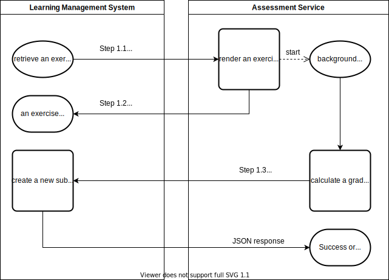
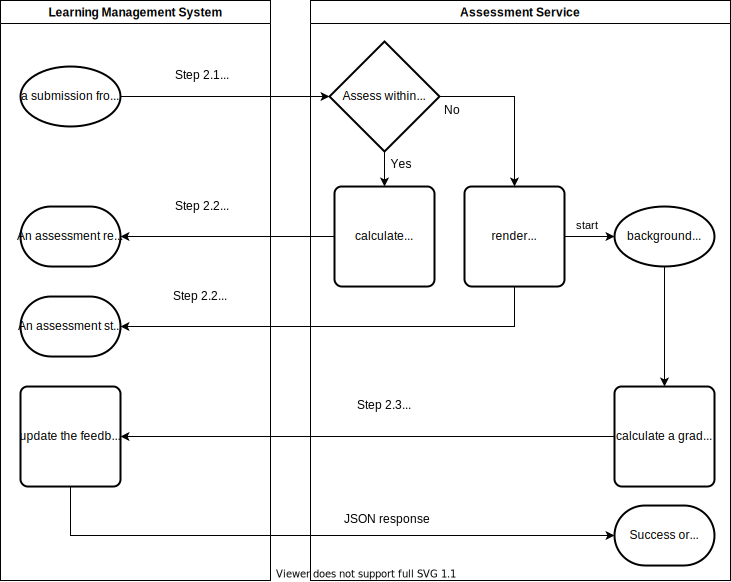

# A+ assessment protocol version 1

This protocol defines the communication format between the LMS and an assessment service.
The protocol makes it possible for the assessment service to be stateless, that is every request contains all the required information for the service to respond.
Additionally, the protocol uses HTTP to transfer the information between services.
This makes it relatively easy to implement a new assessment service.

The protocol consist of two phases: retrieving the exercise definition and submitting a solution to be assessed.
Both phases may start an asynchronous process, which will complete at a later time.
This means that the assessment can be completed synchronously or asynchronously.

## Terminology

* A _submission_ is something an user will provide (e.g. solution to an exercise).

* An _assessment service_ will _assess_ a _submission_, which will yield an _assessment_.
  This is often called _grading_, but as the _grade_ is an optional part, that is not always the case.

* A _grade_ may be part of an _assessment_.
  The _grade_ consists of _points_ and _maximum points_.
  The protocol assumes the minimum points is always zero.

* A _payload_ refers to the content, when it's encoded for transit.
  For example, the `submission_payload` contains the `submission_data` encoded as a JSON string.

## Phase 1, retrieve the exercise

### Step 1.1, the request

The exercise description is retrieved using HTTP GET request.

The request must have the following headers:

* `X-Aplus-Event` (mandatory) must be `aplus.assess.v1/retrieve-exercise`
* `User-Agent` (recommended) should contain the name and the version of the LMS and any other relevant details, e.g., `a-plus/1.7 (+https://aplus.example.com/) python-requests/2.24.0`

Additionally, the following query parameters may be part of the request:

* `lang` (recommended):
  an [IETF BCP 47 language tag](https://en.wikipedia.org/wiki/IETF_language_tag).
  The value for `lang` must match the value, which was used to configure the exercise URL in the LMS.
  Typically, the value is an [ISO 639-1](https://en.wikipedia.org/wiki/ISO_639-1) code, e.g., `en` or `fi`.

* `max_points` (recommended):
  the maximum points for this exercise.
  Can be used to scale and render maximum points for the HTML response.

* `ordinal_number` (recommended):
  ordinal number of the next submission that the user has not yet made, i.e., the value is incremented by one from the current count of submissions.
  The ordinal number for the first request is one.
  If the exercise changes as the submission count increases, the state of the exercise when viewing it matches the state when a new submission is made and graded.

* `submission_url` (recommended): an URL.

  This URL has two different uses:

  * A GET request will yield more details about the exercise, e.g., the JSON schema of the exercise form.
  * A POST request will create a new submission on behalf of the original users (i.e. those in `uid` field).
    See [Step 1.3](#step-13-asynchronously-create-a-submission).

  **N.B.** this field should not be used as part of a cache key, as it likely includes an access token for the assessment service, which might change periodically.

* `uid` (recommended):
  identifiers of users who are viewing the exercise (e.g. students).
  The identifiers are unique inside a course instance, but the same user may have a different identifier on a different course instance.
  Multiple identifiers are sorted and combined into a string with dash as a separator, e.g., "2-14-458" or "aa11-fef3-hex-uuid".
  The LMS must ensure that all `uid` values are unique within the course instance, e.g., if the LMS uses UUIDs, then it has to replace `-` with something else.

  For example, this field can be used for the following purposes:

  * to provide personalized content (i.e. used as a seed for a random number generator)
  * to bucket users to different groups (e.g. for A/B testing)

### Step 1.2, the response

An HTML document including the exercise description and possibly a `form` or an `iframe` element.

If there exists an element with `class="exercise"` or `id="exercise"`, then contents of that element are shown to the user.
Otherwise, then contents of the `body` are shown.

See [Response and feedback HTML](#response-and-feedback-html) for more details.

### Step 1.3, asynchronously create a submission

The assessment service may store the `submission_url`, so it may create a new submission on behalf of the user.
The `submission_url` contains all the required information for the authentication, thus it should be stored securely.
Additionally, the period, when the authentication information is valid, may be limited by the LMS.

The assessment service may make a HTTP POST request to the `submission_url` to create a new submission including the data from the user, the feedback to it and other assessment details for it.
Typically, this is only required when the student browser communicates directly with the assessment service inside an iframe.

**N.B.** because the protocol does not have signed messages, the LMS is only able to authorize the request if it comes from the IP address resolved from the URL configured to the exercise.

The request must have the following headers:

* `Content-Type` (mandatory) must be one of the following:

  * `application/x-www-form-urlencoded` (not recommended), may be used when there is no user data and no feedback or those are only short plain text strings.
  * `multipart/form-data` (default), required in every other case.

* `X-Aplus-Event` (mandatory) must be `aplus.assess.v1/create-new-submission`
* `User-Agent` (recommended) should contain the name and the version of the assessment service and any other relevant details, e.g., `my-grader/0.9 (+https://grader.example.com/) python-requests/2.24.0`

The body of the request must contain following fields:

* `points` (mandatory)
  is a positive integer containing the number of points given to the user for the submission.

* `max_points` (mandatory)
  is an positive integer containing the maximum points.

* `feedback` (recommended)
  is the feedback content to be shown to the user.
  Currently supported content types are `text/html` and `text/plain`, which must be indicated in the multipart data.

  **N.B.** this is the full content and the LMS will not search for elements with `class="exercise"` for example.

* `submission_payload` (optional)
  is a JSON string containing data related to the user submission.
  This can be the data from an interactive JavaScript learning object passed to the assessment service.

* `grading_payload` (optional)
  is a JSON string containing data related to the assessment.
  See [step 2.3](#step-23-asynchronous-update) for details and the structure of the data.

The grade is calculated from the `points` and `max_points`.
For example, `points=12` and `max_points=100` would yield 12% of the maximum points defined in the LMS for that exercise.

This request does not support fields `error` and `notify`, which are supported for the [step 2.3](#step-23-asynchronous-update).
Thus, if there are errors, do not make the request.

#### Response for asynchronously creating a submission

If the POST data is accepted, then the LMS will respond with a content type `application/json` and `{"success": true}`.
In case of errors, the response will contain `{"success": false, "errors": ["a list of strings"]}`.

If the request does not accept other than `text/plain`, then the response will be a string `ok` or `error`.

In addition, the status code for the response is:

* 201 when a new submission was created, i.e., the response is `{"success": true}`
* 400 when there are errors in the data
* 403 when the authentication is invalid, i.e., the `submission_url` is wrong or has expired.

**N.B.** also verify the `success`, as older implementations might not return 400 in case of errors.

## Phase 2, assess the submission from the user

### Step 2.1, the request

To assess the submission, the LMS will send the data from the user using HTTP POST to the assessment service.

The request must have the following headers:

* `Content-Type` (mandatory) must be one of the following:

  * `application/x-www-form-urlencoded` (optional), may be used when there is no files
  * `multipart/form-data` (default), required when there are files

* `X-Aplus-Event` (mandatory) must be `aplus.assess.v1/assess-submission`
* `User-Agent` (recommended) should contain the name and the version of the LMS and any other relevant details, e.g., `a-plus/1.7 (+https://aplus.example.com/) python-requests/2.24.0`

Similarly to the [step 1.1](#step-11-the-request), the request contains set of query parameters.
The following parameters are the same as in the step 1.1:

* `lang` (recommended)
* `max_points` (recommended)
* `uid` (recommended)

However, the following parameters have some differences:

* `ordinal_number` (recommended):
  ordinal number of the submission that this request is about.
  The ordinal number for the first submission is one.

* `submission_url` (recommended): an URL.

  This URL has two different uses:

  * A GET request will yield more details about the submission, e.g., the JSON schema of the exercise form and list of submitters.
  * A POST request will update the submission object in the LMS.
    See [step 2.3, asynchronous update](#step-23-asynchronous-update).

  **N.B.** this field should not be used as part of a cache key, as it includes a reference to a single submission and an access token for the assessment service, which changes periodically or per submission.

### Step 2.2, the response

An HTML document including the submission feedback or the status.
The document may include a `form` for resubmission, which might be handy with questionnaires.
If there exists an element with `class="exercise"` or `id="exercise"`, then contents of that element are shown to the user.
Otherwise, then contents of the `body` are shown.

Additionally, following meta fields have special meaning:

* `<meta name="status" value="">` (mandatory),
  where the `value` is one of `accepted`, `rejected`, or `error`.

* `<meta name="points" value="">` (optional),
  where the `value` is a positive integer containing the number of points given to the user for the submission.

* `<meta name="max_points" value="">` (required with `points`),
  where the `value` is an positive integer containing the maximum points.

* `<meta name="wait" value="">` (optional),
  where the `value` is an integer indicating how long the assessment should take in seconds, i.e, how long the user should wait for the assessment to be completed.
  When the time is not known, then this field should be left out (e.g.in case of a  manual assessment).
  Non-integer values (e.g. "yes"), should be read as "some acceptable time" (e.g. few minutes).

There are four possible outcomes:

* Assessed:
  If the `status` is `accepted` and the `points` is provided, then the submission is marked as assessed and no future updates are expected, but are allowed.
  If the assessment does not have a grade, then `points` and `max_points` must have `0` as a value and can not be left out.

* Assessment is pending:
  If the `status` is `accepted` and the `points` is not present (or is empty), then the submission is assumed to be asynchronously assessed.
  This is the case, when the `wait` may be used to indicate the expected duration of the assessment.
  The LMS should assume, that The `points` are submitted via the asynchronous interface at a later time.

* Rejected:
  If the `status` is `rejected`, then the submission was not accepted.
  This can be due to invalid data in the form, e.g., a string in a number field or a missing value in a required field.
  Rejected submissions are not retried by the LMS.

* Error:
  If the `status` is `error`, then there is a persistent or a temporary error with the assessment service.
  The LMS may try to resubmit the same submission again at the later time.

  However, the LMS should assume that if one submission fails for an exercise, it should not try another one, i.e., all submissions for the same exercise should be expected to raise an error.
  Errors should be notified to the course stuff, so they may help to fix them.

The grade is calculated from the `points` and `max_points`.
For example, `points=12` and `max_points=100` would yield 12% of the maximum points defined in the LMS for that exercise.

### Step 2.3, asynchronous update

The assessment service may store the `submission_url`, so it may upload the feedback later or update an existing feedback.
The `submission_url` contains all the required information for the authentication, thus it should be stored securely.
Additionally, the period, when the authentication information is valid, may be limited by the LMS.

The assessment service may make a HTTP POST request to the `submission_url` to update the feedback and other assessment details for the submission.
Typically, this would happen only once as a result of completed asynchronous assessment, but the service may make multiple updates too.

**N.B.** because the protocol does not have signed messages, the LMS is only able to authorize the request if it comes from the IP address resolved from the URL configured to the exercise.

The request must have the following headers:

* `Content-Type` (mandatory) must be one of the following:

  * `application/x-www-form-urlencoded` (not recommended), may be used when there is no feedback or it is a short plain text string.
  * `multipart/form-data` (default), required when there is an HTML content in the `feedback`.

* `X-Aplus-Event` (mandatory) must be `aplus.assess.v1/update-assessment`
* `User-Agent` (recommended) should contain the name and the version of the assessment service and any other relevant details, e.g., `my-grader/0.9 (+https://grader.example.com/) python-requests/2.24.0`

The body of the request must contain following fields:

* `points` (optional)
  is a positive integer containing the number of points given to the user for the submission.
  If this field is not present (or is empty), then the submission is kept in the pending state (accepted, but not assessed).

* `max_points` (required with `points`)
  is an positive integer containing the maximum points.

* `feedback` (recommended)
  is the feedback content to be shown to the user.
  Currently supported content types are `text/html` and `text/plain`, which must be indicated in the multipart data.

  The content will replace the existing content in case of an update, so if the assessment service needs to append, then it has to do that internally.

  **N.B.** this is the full content and the LMS will not search for elements with `class="exercise"` for example.

* `grading_payload` (optional)
  is a JSON string containing data related to the assessment.
  This field must have a content type `application/json`.

  The following keys are registered to the protocol and may be used by the LMS too:

  * `errors` (optional)
    may contain a plain text string containing errors from the assessment (e.g. contents of the stderr).
    This value should help staff to debug problems.

  Rest of the data should be considered assessment service specific and can, e.g, be used to re-assess a submission with the same randomness.
  However, it's a good idea to select keys so that there is a lowered risk for them to collide with keys registered to the protocol in the future.

  **N.B.** the LMS should not show this data to the user, but it may show it to staff (e.g. `errors`).

* `error` (optional)
  is a string and may contain values `error` or `rejected`.
  Note that the LMS should map values `false`, `no`, and `0` to an empty value and any other invalid value to `error`.
  When the field exists and has a valid value, then the submission is set to the respective state (see outcomes from the response section above).
  Future updates to the submission may be blocked, thus the assessment service may forget the `submission_url` after the request.

* `notify` (optional)
  is a string and may contain values `normal` or `important`.
  This value indicates if the user should be notified about the result, which is often a good idea for a manual feedback.

  The LMS may limit the notification importance and the user may configure how different notifications are send to them.
  Nevertheless, the principle is that the `normal` would make an in-application notification and the `important` would make a desktop or a push notification, or even send an email.

#### Response for asynchronous update

If the POST data is accepted, then the LMS will respond with a content type `application/json` and `{"success": true}`.
In case of errors, the response will contain `{"success": false, "errors": ["a list of strings"]}`.

If the request does not accept other than `text/plain`, then the response will be a string `ok` or `error`.

In addition, the status code for the response is:

* 200 when existing object was updated, i.e., the response is `{"success": true}`
* 400 when there are errors in the data
* 403 when the authentication is invalid, i.e., the `submission_url` is wrong or has expired.

**N.B.** also verify the `success`, as older implementations might not return 400 in case of errors.

## Response and feedback HTML

The assessment protocol does not care about the HTML content, except for following classes and attributes.
For more content details, see [assessment presentation formats](../#assessment-presentation-formats).

### HTML Classes

Elements with a following classes have special meanings:

* `.exercise` (or `id="exercise"`)
  defines the bounds of the exercise or the feedback.
  If there exists an element with this class (or id), then only contents of that element will be used.
  Otherwise, contents of the element `body` will be used.

  **N.B.**: The `#exercise` is not usable in the CSS and JavaScript, as it should be removed by the LMS (and replaced with the class).

* `.exercise-title`
  defines the title of the exercise.
  The content of the element should not change between phases or users, as it may be cached.
  The LMS can hide this or move it out of an exercise frame.

* `.exercise-description`
  defines the element containing the description and directions for the student.
  The content should not change between phases or users, as it may be cached.
  **Do not** wrap personalized content in this class.
  The LMS can move this out of an exercise frame.

Reserved class names for the LMS.

* `.exercise-summary`

## Known drawbacks

There are number of known issues, which require addressing.

* Security.
  Currently, protocol assumes that the LMS and assessment services communicate in a trusted network.
  However, the network might include executing code from the user as part of an assessment process.
  Additionally, if the LMS verifies the `submission_url` based on the assessment service URL, then using different containers for the step 1.3 and the step 2.3, might become impossible due to a different IP address.

* Trusted storage for personalized data.
  The assessment service should be able to provide data (e.g. a seed for random number generator) in the step 1.2, which would be stored in the LMS and not provided to the client.
  This data would be added to the HTTP POST in the step 2.1.
  As a result, the assessment service could be stateless also when using personalized content

  Currently, a possible workaround is to embed the data as a hidden field.
  The data should be digitally signed at least, but possibly also encrypted.
  One could use tools like [JWT](https://jwt.io) or [Branca](https://github.com/tuupola/branca-spec) to implement this.
  Note that regrading exercises will become impossible, when the secret key changes.

## Removed features

Features, which have been part of the API.

* A query parameter `post_url`.
  The assessment service was expected to use this when rendering the form, but that is not required anymore as the JavaScript can capture the form submit event and send it to correct URL.

  **N.B.** this was the best guess of the exercise identifier as the `submission_url` likely contains reference to the submission, not the exercise.

* A query parameter `max_submissions`.
  Indicated how many submissions the user has for the exercise.
  This was used to show the model answer to the questionnaire once maximum submissions limit was reached.
  However, this system can not be implemented correctly, and thus it's the LMS's responsibility to authorize access to the model solution.

* A special HTML data attribute `data-aplus-once="yes"`.
  Removes elements with this tag from the data stored to the database.
  Is used to implement feature where correct answers are shown after last submission.
  Instead, there should be feature in the LMS to lock the submissions and show the model.
