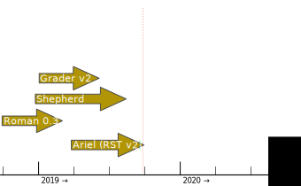
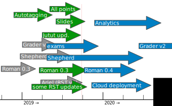

:title: Roadmap of A+ LMS
:author: Jaakko Kantojärvi
:description: Short presentation about current roadmap of A+ LMS and it's microservices

:data-transition-duration: 2000
:skip-help: true

:css: presentation.css

.. header::

   .. image:: https://apluslms.github.io/assets/images/apluslogo.png

.. footer::

   Roadmap of A+ LMS by Jaakko Kantojärvi

   .. image:: aalto.png

----

:data-scale: 1
:data-x: r1200
:class: center_text

Roadmap of A+ LMS
======================

Yearly status updates

----

Design principles
=================

* One service should do one thing well.
* Make services error resilient. No cascading failures.
* Refactor and redesign. Pay back technical dept.
* From prototypes to real mature products.
* Utilise containers.

.. note::

  * Process started with shepherd on the way
  * Designing started for cloud support

----

Last year's plan
================

----

:data-x: r0
:data-y: r0

Reality and a new plan
======================

.. note::

  * Roman and Shepherd development started well and are going on well
  * Lot of A+ development, that was not planned last year

  * Ariel shelved for now
  * Grader v2 pushed back a lot
  * Instead, cloud management needs to be done first
  * Shepherd production usage pushed from Winter to Summer
  * Roman is not going to replace docker-up.sh as early as hoped (if ever)
  * Analytics is a new
  *

----

:data-x: r1200

:class: center_text

|
|

Questions?
==========

More info on

`apluslms.github.io <https://apluslms.github.io>`_
